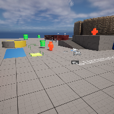

# Project Name  MDEV1003w23

## Description

A github repository for the in class demonstrations.   
 
Attributions: 

## Usage
Clone, or download the zip, to a local directory. Open in Unreal Engine 4.27 or newer

## Attributions
1. Eerie Forest, FrenchyBoy, OpenGameArt, ( https://opengameart.org/content/eerie-forest  )
2. explosion, Luke RustLtd, OpenGameArt, ( https://opengameart.org/content/bombexplosion8bit ) 
3. desert highway low angle image, Jakob Owens, Unsplash, ( https://unsplash.com/photos/1_0KyvVdtP4 )
4. added a maze model created via the MazeGenerator site ( https://www.mazegenerator.net  )
5. TinCan.wav, Vinrax, OpenGameArt, https://opengameart.org/content/metal-sounds
 

